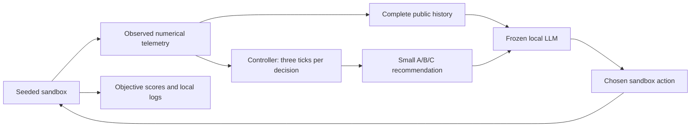

# Fly regulator lab

A local experiment testing whether a persistent controller built from measured larval fruit-fly connectivity helps a frozen LLM handle changing constraints. It includes five main conditions, two causal ablations, raw results and a localhost browser interface. This is an engineered numerical controller, not a talking fly or simulation of consciousness.

## Open the experiment

Double-click **Launch.command** in this folder, then open **http://127.0.0.1:8765**. Or ask Codex: **“Open the fly regulator lab for me.”** The existing LM Studio model is loaded only if needed. No model download or system installation occurs. Closing the terminal/Ctrl+C stops the interface; no always-running regulator daemon is installed. LM Studio can retain its loaded model until you unload it in that app.

- **Step** advances three environment ticks and asks the local LLM for one action.
- **Run** finishes the six-decision episode. **Stop** prevents further decisions; an in-flight request can finish.
- **Reset** starts a fresh independent episode using the visible settings.
- Change energy recovered per recharge or tool reliability, then Reset to apply. Empty reliability overrides preserve seeded changes.
- **Compare all conditions** replays identical seed/settings in each condition using fresh local inference. Stop also stops the comparison sequence.
- **Locked evaluation & replay** displays saved test decisions and paired condition outcomes without inference. Exploration never changes the locked test.

The model sees the same task rules, public numeric observations and history in every condition. A controller recommends A/B/C through the same explicit interface, and the LLM chooses the actual action. Controller recommendation agreement alone is not evidence of influence; see the paired intervention results.

## Three requests you can give Codex

1. “Open the lab, set tool A to 20% reliability and tool B to 80%, and compare all conditions on seed 42.”
2. “Replay a locked resource episode where the fly regulator differed from the simple controller, and explain each decision in plain English.”
3. “Show what the pilot says about persistence and measured wiring, then propose the smallest useful follow-up without starting a larger run.”

## What to read

- **RESULTS.md** — what actually ran, outcomes, uncertainty, costs and limitations.
- **PROTOCOL.md** and **run_config.json** — frozen choices and budgets.
- **RESEARCH.md** — primary sources, close precedents, evidence and separate licences.
- **HARNESS_REVIEW.md** — the separate audit, fixed leakage bug and unresolved limitations.
- **STATUS.md / AGENTS.md** — continuation instructions for a later Codex session.

## Reproducibility and files

`experiment.py` contains tasks, controllers, local inference, training and evaluation. `web/` is a standard-library HTTP server and static browser UI. `tests/` checks graph invariants, scoring, resets, determinism and observation boundaries. Python 3.14.7, NumPy 2.4.3 and SciPy 1.17.1 are installed in `.venv`; `requirements.txt` pins dependencies. Existing Qwen3.5-4B Q4_K_S is hashed in `runs/machine.json`.

`data/` retains the pinned measured archive, derived fixed graphs, three rewires/random graphs, small readouts, provenance and dynamics diagnostics. These files remain local; the archive's specific redistribution terms were not verified. `research/` contains pinned upstream metadata and source files inspected but never executed.

`runs/` contains raw API requests/responses, complete episode traces, fitted-choice records, call reservation ledger, protocol lock, process-memory samples, causal probes and analysis. All early failures are retained. Validation and validation_v2 were contaminated by a history-field leakage bug and must not be cited as valid performance evidence. The bug was caught and fixed before the frozen test; validation_v3 verifies the sanitized interface. The protocol lock records exact execution/data/readout hashes and timestamp.

To run non-inference checks: `.venv/bin/python -m unittest discover -s tests -v`. Audit locked logs with `.venv/bin/python scripts/audit_harness.py test`; recompute descriptive statistics with `.venv/bin/python scripts/analyze.py`. Neither uses an LLM. Rerunning the pilot is intentionally blocked by existing output and the initial call cap. A larger independent run needs user approval and a new protocol/run directory, preserving these results.

Both tasks are new, small sandbox tasks inspired by prior methods, not reproduced EVAAA/conn2res benchmark scores. The supplied graph contains 2,952 neurons; it is not claimed to be the full final-paper 3,016-neuron graph or an adult fly CNS.

## Information flow

Hidden schedules and latent reliability stay inside the sandbox/scorer. Scoring-only fields are excluded from the LLM history and all controller inputs.
